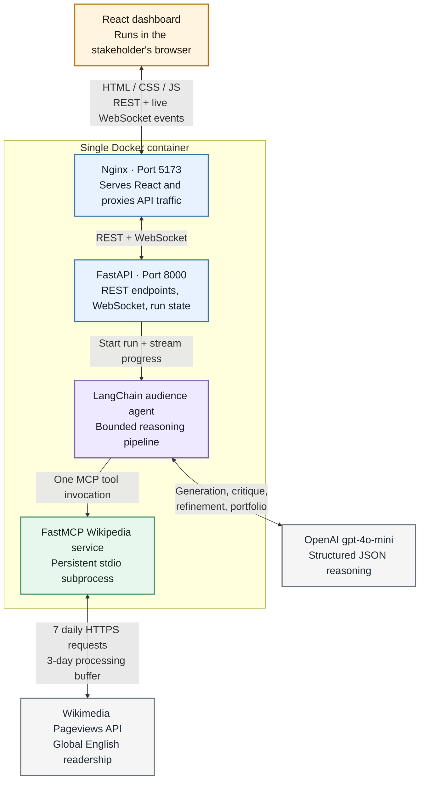
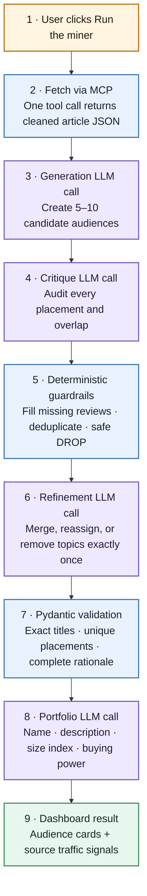

# Autonomous Audience Trend Miner

This prototype turns public Wikipedia Pageviews into an **Emerging Audience Portfolio** for brand marketers. It mirrors how ad-tech and marketing platforms package broad behavioral signals into coherent, sellable audience segments, while making an important distinction: Wikipedia traffic is an aggregate interest signal, not individual-level identity or purchase-intent data.

The application fetches the latest processed English Wikipedia trends, aggregates seven days of traffic, removes obvious utility-page noise, and asks `gpt-4o-mini` to discover commercially meaningful themes. A fixed generation → critique → refinement loop makes the reasoning visible and cost-bounded before a final LLM call writes the market-facing portfolio.

## What the app produces

Each audience card includes:

- a market-friendly audience name;
- a two-sentence, stakeholder-friendly brief that names representative traffic
  signals and explains the cluster's shared interest and brand relevance;
- an Estimated Size Index calculated as the cluster's article views divided by all views in the fetched trending list; and
- a High/Medium/Low buying-power assessment with relevant brand categories.

The size percentages do not necessarily sum to 100%. The denominator includes the full fetched trend list, while the agent intentionally drops non-commercial or incoherent topics.

## Architecture

### System view

This view shows where each responsibility lives and which boundaries are
network, LLM, or MCP boundaries.



### What happens during one mining run

This view expands the agent box above. It is intentionally vertical so every
stage and label remains readable at normal GitHub zoom.



In short: the browser starts one WebSocket-driven run; FastAPI invokes the
Wikipedia MCP tool once; the MCP server independently fetches and cleans public
traffic data; and the agent transforms that JSON through a bounded
generation → critique → refinement → validation → portfolio pipeline. Only the
validated portfolio and live progress events return to the dashboard.

The separation is deliberate:

- `mcp_server/wikipedia_server.py` owns HTTP access, date selection, normalization, aggregation, and data-level filtering. It has no LLM or UI imports.
- `agent_layer/audience_agent.py` can access trend data only through the MCP protocol. `langchain-mcp-adapters` loads the server tool into LangChain, and the tool is genuinely invoked over stdio rather than importing the fetch function directly.
- `api_layer/main.py` owns the HTTP/WebSocket contract and the application lifecycle. It imports and reuses the agent's Pydantic models rather than redefining them.
- `frontend/` owns display and browser interaction only. It does not know Wikimedia response shapes or clustering prompts.

The FastAPI lifespan retains one `PersistentMCPToolClient`. That resource gives the stdio session a dedicated long-lived event loop, so repeated browser runs reuse the same spawned MCP process until the API shuts down.

## Frontend architecture

The browser opens `WS /ws/run` when the user starts a run. That connection
immediately launches the fixed agent pipeline, streams each progress callback
into the terminal-style wire log, and finishes with the validated portfolio.
`GET /api/portfolio/latest` restores the last successful result after a page
refresh, while `GET /api/trends/latest` supplies the real article view counts
captured from the same single MCP tool response.

The visual hierarchy mirrors the assignment's transformation: the amber ticker
keeps raw public traffic visible at the top, the agent wire shows the bounded
reasoning stages in motion, and the quieter portfolio cards present the processed
commercial insight. This makes the path from raw signal to structured audience
legible during a stakeholder demo.

## Agentic clustering loop

The clustering stage is visibly implemented as three separate LLM calls, not one prompt-to-JSON request:

1. **Generation:** create 5-10 initial commercial clusters from exact article titles.
2. **Critique:** independently audit every article assignment, commercial relevance, semantic cross-cluster overlap, unsupported/misassigned articles, and residual noise. Multi-domain people must receive an explicit competing-cluster review.
3. **Refinement:** apply that critique exactly once and emit one placement decision per retained article. The deterministic guardrails reject uncovered critique assignments and duplicate placements, remove retained noise, and conservatively drop flagged articles that lack a concrete ambiguity resolution.

Every pass prints a separately labeled structured payload to the API terminal for debugging and video demonstration. The API portfolio retains the final article-level placement decisions for auditability, while the frontend keeps each card scannable with a collapsed source-signal disclosure. The refined clusters are Pydantic-validated and checked against the original article-title set. Portfolio generation is a fourth, sequential structured-output call. If final parsing or cluster mapping fails, it retries once with stricter formatting instructions.

This fixed pipeline is intentionally deterministic: the LLM does not decide whether to fetch again, critique again, or call an unrelated tool. That keeps the demo debuggable, limits cost, and makes the assignment's clustering/critique loop unambiguous.

## Project structure

```text
.
├── mcp_server/
│   └── wikipedia_server.py
├── agent_layer/
│   └── audience_agent.py
├── api_layer/
│   └── main.py
├── frontend/
│   ├── src/
│   └── package.json
├── deploy/
│   └── nginx.conf
├── Dockerfile
├── compose.yaml
├── tests/
├── .env.example
├── requirements.txt
└── README.md
```

## What you need before running

Three pieces make up the app, and only two of them need a command from you:

| Piece | What it is | How it starts |
|---|---|---|
| MCP data service (`mcp_server/`) | Wraps the Wikimedia Pageviews API | Started **automatically** by the FastAPI backend over stdio — no separate command or terminal |
| FastAPI backend (`api_layer/`) | Runs the agent pipeline, serves WebSocket/REST | `uvicorn api_layer.main:app --reload` |
| React frontend (`frontend/`) | Dashboard UI | `npm run dev` (or served by Nginx via Docker) |

You need exactly one API key to run this app:

- **Wikimedia Pageviews API** — public and unauthenticated. No key, no signup, no `.env` entry needed.
- **OpenAI API** — required for `gpt-4o-mini`. Obtain a key at platform.openai.com and set it as `OPENAI_API_KEY` in `.env` (steps below).

## Setup

Python 3.11 or newer and Node.js 20 or newer are recommended.

```bash
python -m venv .venv
source .venv/bin/activate
python -m pip install -r requirements.txt
cp .env.example .env
cd frontend
npm install
```

Edit `.env` and add your OpenAI key:

```dotenv
OPENAI_API_KEY=your-real-key
```

The Wikimedia endpoint is public and unauthenticated, so it needs no API key. `.env` is gitignored and must never be committed.

The frontend's non-secret API location is already defined in `frontend/.env`:

```dotenv
VITE_API_BASE_URL=http://localhost:8000
```

## Running with Docker (recommended)

Docker Compose builds the React application, installs the Python service, and
starts both Uvicorn and Nginx inside one container. Nginx serves the compiled
frontend on port `5173` and proxies both REST and WebSocket requests to FastAPI;
FastAPI then spawns the MCP server internally over stdio — this is the same
automatic startup described above, so there is no separate MCP command here either.

After creating `.env` and adding your real `OPENAI_API_KEY`, run from the
repository root:

```bash
docker compose up --build
```

Open `http://localhost:5173`. There is no separate frontend, backend, or MCP
startup command. Press `Ctrl+C` to stop the attached container, or run:

```bash
docker compose down
```

The `.env` file is excluded from the Docker build context and injected only at
container runtime. The OpenAI key is therefore not copied into an image layer or
the compiled browser bundle.

## Running without Docker

The React application and FastAPI service run as two local processes. From the
repository root, start the backend in the first terminal:

```bash
source .venv/bin/activate
uvicorn api_layer.main:app --reload
```

In a second terminal, start the frontend:

```bash
cd frontend
npm run dev
```

Open `http://localhost:5173`. The FastAPI lifespan automatically spawns
`mcp_server/wikipedia_server.py` over **stdio** and retains that connection; the
MCP server does not need a third terminal or a manual startup command.

Click **Run the miner**. The live agent wire shows:

1. Fetching trends via MCP
2. Clustering into audience themes (generation, critique, refinement)
3. Generating audience portfolio

The terminal shows the full structured output of each reasoning pass.

## Tests

The unit tests cover the three-day lag anchor, missing-day behavior, title normalization/filtering, multi-day aggregation, exact-article validation, and size-index math.

```bash
python -m unittest discover -v
python -m compileall api_layer agent_layer mcp_server tests
cd frontend
npm run lint
npm run build
```

An end-to-end run additionally requires network access to Wikimedia and a valid `OPENAI_API_KEY`.

For a terminal-only demonstration that prints every reasoning state and the final portfolio:

```bash
python -u scripts/run_pipeline.py
```

## Known limitations

- A "week" is approximated as the last seven processed days. The newest requested date is three days before today to buffer Wikimedia's typical 1-2 day processing delay. Any still-missing day is logged and skipped.
- Trending data reflects **English Wikipedia globally**, not US-specific traffic. The Pageviews top endpoint has no country-scoped variant.
- Wikipedia interest is contextual evidence, not proof that a reader belongs to a demographic or intends to buy. The output is suitable for ideation and human review, not autonomous ad targeting.
- The top-article endpoint favors large cultural moments. The LLM removes additional tragedy, crime, politics, obituary, and weak commercial themes after the server's deterministic namespace/noise filter.
- Audience size is a normalized traffic index, not a population estimate or forecast.

## Deployment Strategy

The included multi-stage Docker build compiles React without shipping Node.js in
the runtime image. The final container runs as a non-root user, serves the static
frontend through Nginx, proxies API and WebSocket traffic to Uvicorn, and lets
FastAPI spawn the MCP server as a local stdio child. The container receives
`OPENAI_API_KEY` at runtime and sends service logs to stdout/stderr.

For production scaling, the three deployable surfaces can become separate containers or managed processes:

- an MCP data-service container exposing authenticated **Streamable HTTP** instead of stdio;
- a FastAPI application container using the same LangChain adapter boundary; and
- a separately deployed static React frontend configured with the public API URL.

That transport change is necessary because stdio is a local parent/child transport and does not cross container hosts. On AWS ECS, the services could run in one task for low-latency sidecar-style deployment or as separate services behind private service discovery. Render and Fly.io can run the two processes as private services. Autoscaling, request timeouts, retries, secret injection, egress controls, structured logs, and a short-lived cache for the daily Wikimedia response would be added before production.

Serverless functions are possible after adapting the MCP service to stateless HTTP, but long-lived stdio subprocesses are a poor fit for per-request functions. A scheduled function could pre-aggregate Wikimedia data into object storage, while an API function and the LLM application consume that cached snapshot. This reduces cold-start work and avoids repeatedly fetching the same daily public data.

## Security and reliability notes

- API keys are loaded with `python-dotenv` and `os.getenv`; they are never passed to the public MCP server or hardcoded.
- The MCP server uses request timeouts, a descriptive Wikimedia User-Agent, graceful per-day error handling, and explicit input bounds.
- Article titles are treated as untrusted data in every LLM prompt and cannot introduce instructions.
- Structured output, Pydantic models, exact source-title checks, a deterministic size calculation, and a single retry constrain common LLM failure modes.
